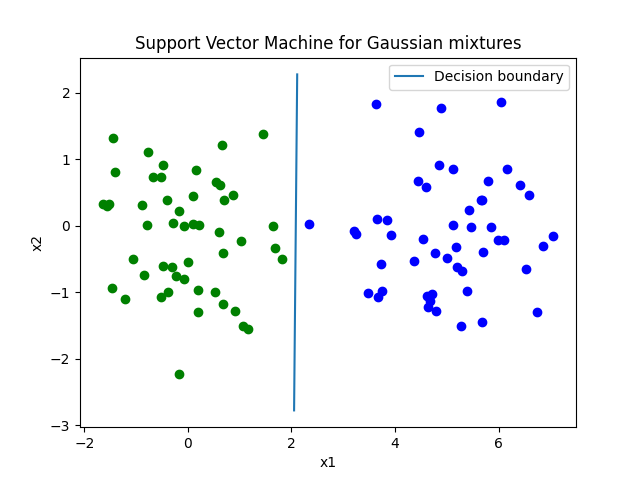

# Support Vector Machine for Gaussian mixtures

This repository contains the code for classifying Gaussian clusters with Support Vector Machine



## How to run
1) Install the modules in ```requirements.txt```
2) Run the Jupyter Notebook